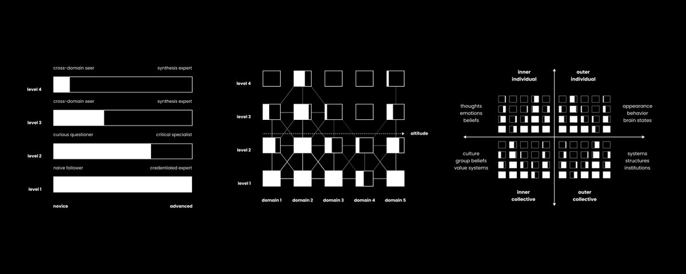
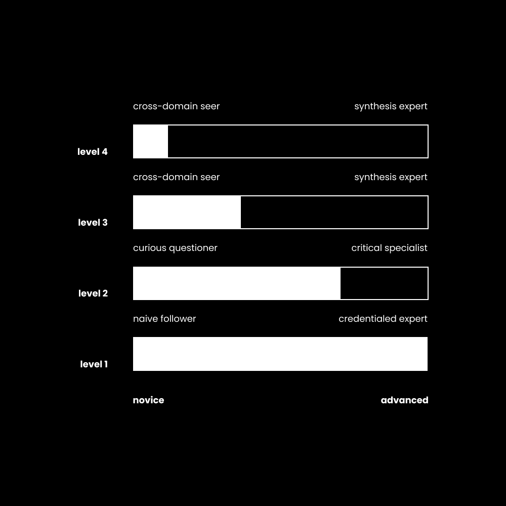
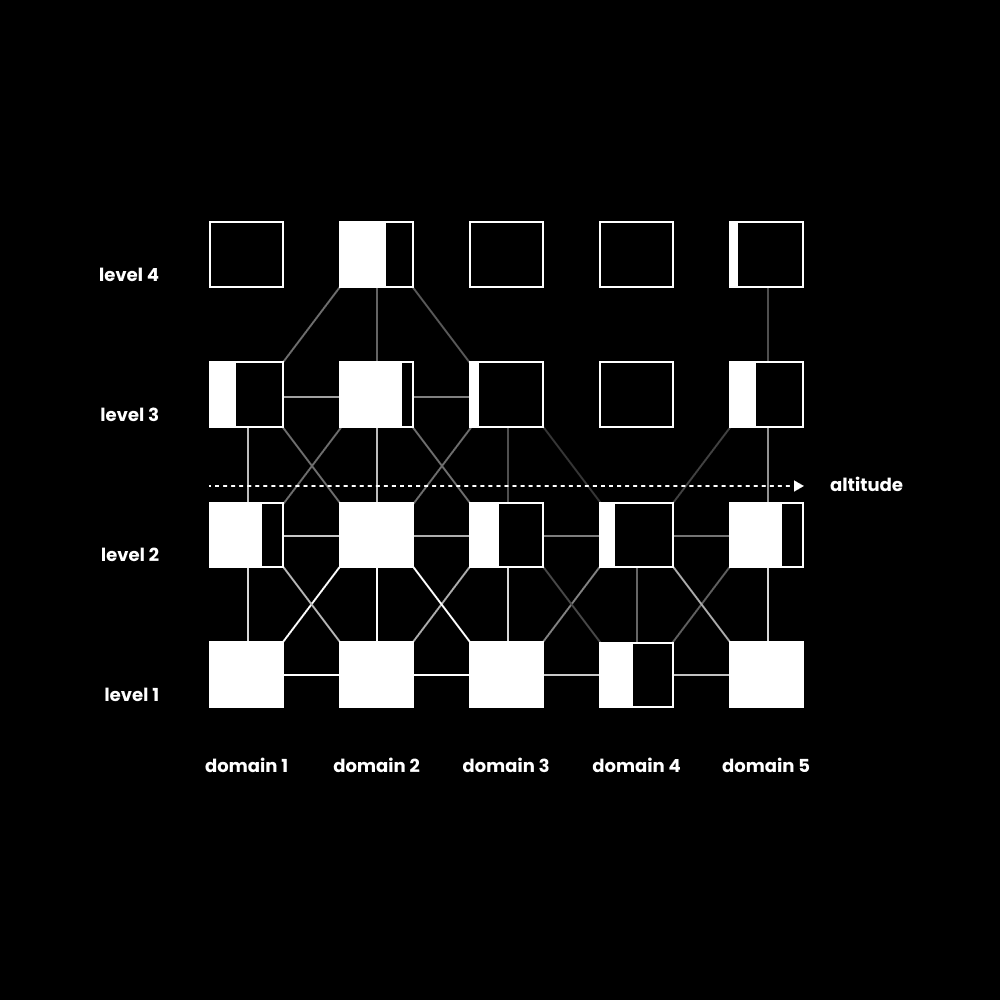
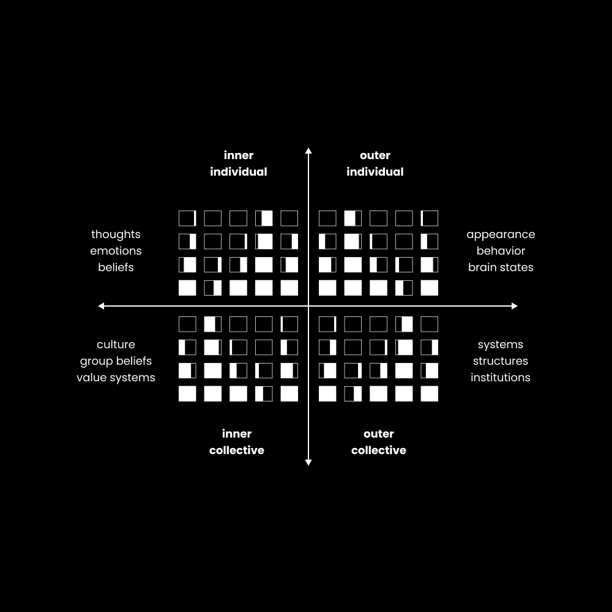

# 如何像战略天才一样思考（5d思维）

>来源：https://x.com/thedankoe/status/2016200242690195509

## 如何像战略天才一样思考（5d思维）

你的思考能力决定了你人生的结果。

这并不夸张，学会思考从未如此重要。

特别是如果你认为自己是一个聪明人，因为你最有可能像白痴一样思考。

我的意思是，社交媒体上到处都是。没有哪一天你会看到一个智商高的人掉进明显的陷阱。

有很多聪明人住在妈妈的地下室里，只要一根炸薯条就可以心脏病发作，也有很多愚蠢的人异常快乐、健康和富有。

我不想谈论第一性原理思维、系统思维、元认知或任何其他你可以要求 ChatGPT 教你的东西，我想给你一些不同的东西。

我们将从一维思维开始，慢慢走向五维思维。

如果你仔细阅读，你会体验到在新的层面上思考是什么感觉。

## 

如果你这么聪明，为什么会破产呢？

> 信仰比信仰好得多。信念是当别人思考时。 ——巴克明斯特·富勒

第一条思考技巧：

如果你想了解某物是什么，就像天才级的思维一样，那么了解它不是什么会有所帮助。

这样，我们就可以识别并避免愚蠢的想法。

当我们观察愚蠢的想法是什么样子时，我们得出一些见解：

- 愚蠢的思维是一维的。人们试图把一切都塞进自己的视角，很难看到外面的世界。
    
- 愚蠢的想法是还原论。例如，某一领域（例如商业）的专家试图将所有问题简化为“策略”问题。
    
- 愚蠢的想法是部落的。你只信任你的团体、政党或部落，并认为其他人都是错的，因为他们不服从。
    
- 愚蠢的想法不会质疑。你的理由是“事情就是这样完成的”。
    

总的来说，愚蠢的想法就是一旦你达到了你所知道的极限，就关闭你的思维。

愚蠢的思考就是过早停止思考。达到这样的地步：你按照预先设定的想法做出反应，却无法获得任何新奇的见解。

有了这个，我们可以开始猜测天才思维的一个有价值的定义，它可能是：

将威胁性想法保留在可能性范围内的能力，与理解而不是仅仅知道的意图相结合。天才思维的标志是通过宽度、深度和高度来说明的，在这些宽度、深度和高度上，你可以思考而不会被阻止进一步冒险，这通常是因为将一个想法视为绝对。这是你遍历完整、普遍的思想网络（现实、所有潜在知识）并将它们组合成连贯或有用的东西（即使不是全新的东西）的能力。

那么问题是，知道和理解之间有什么区别？如何发展思想的宽度、深度和高度？如果你能更进一步呢？

知道是水平的。你会学到很多东西并记住特定领域的事实，直到你变得有能力。懂得多的人是“专家”，但当今世界我们不需要更多的专家。

理解是垂直的。这是关于你的整个认知操作系统的复杂程度。一个人可以在知之甚少的情况下了解很多，并利用这种洞察力采取行动，从而产生更有价值的结果。

“聪明笨”的现象源于横向先进纵向卡住。一个拥有世界上所有钱的商人却发现自己不快乐。一个有着美丽作品却无法谋生的创意者。一个无法维持稳定关系的笨蛋。他们在各自的领域知道很多，但看不到知识泡沫之外的东西，而知识泡沫并没有提供足够的表面积来识别和解决导致痛苦的问题。

这就是为什么学习如何思考如此重要。

因为你的思想就是你与现实互动的方式。

你处理信息→理解它（思考）→做出选择→接收信息作为反馈→回应该反馈并重复这个循环。

那么，思考决定你人生的结果。

每一个你陷入愚蠢思考的时刻都会产生复合效应，让你陷入深深的困境，你甚至无法获得引导你走出困境的想法。

## 

海拔、层次、思路

> 你无法从创造问题的同一意识水平来解决问题。 ——阿尔伯特·爱因斯坦

让我们从头开始工作。

思维线是你可以了解很多的领域。

线条代表水平展开（宽度）。

这些可以是任何东西。市场营销、天体物理学、政治、社会动力学、宗教等。当你尝试学习特定领域的知识时，你就在扩大思维的宽度。这就像在电子游戏中获得经验一样。

（顺便说一句，如果你研究过肯·威尔伯，你就能明白我在这里得到的内容，只是应用于思考）。

思考层次是你如何思考每一行。

级别代表垂直发展（深度）。

当我们观察集体和个人的认知发展如何随着时间的推移而演变时，我们可以注意到 5 个核心模式：

- 本能（0级）——你生来的行为是出于纯粹生存的需要。你对刺激做出反应，中间几乎不思考。
    
- 墨守成规（1 级）——非黑即白的思维。你遵守规则，服从权威，不加质疑。你采纳别人的观点。
    
- 个人主义者（2级）——批判性思维出现，你构建自己的模型。您建立自己的观点。
    
- 综合（3级）——您将您的模型视为众多模型之一。你持有矛盾，并使用观点作为工具，而不是法律或一些不容置疑的真理。
    
- 生成（4级）——你创造出以前不存在的原创观点，或者你在没有外界影响的情况下提出想法。
    

1级和2级可以被认为是“第一层”思维，这是过于教条的。我是对的你是错的。

第3层和第4层可以被认为是“第二层”思维，它拒绝教条并寻求位于中间的最终真理。

在意义领域，你经常被灌输一种信仰体系，然后你质疑该信仰体系并得出自己的结论（通常拒绝先验），然后你开始看到所有信仰体系中的真理，最后你有能力创建一个更广泛的信仰体系。

在政治上，我们看到的大部分战斗和暴力都是针对在 1 级和 2 级范围内运作的普通民众。我的群体与你的群体。双方都无法超越自己的泡沫进行思考。

再次，我想把这一点说得非常清楚，因为这是一个很容易陷入的陷阱：

天才思维就是持续思考的能力。

在每个思维层面，你驾驭已知和未知想法空间的能力都在不断扩展。当你出生时，你并没有真正思考。当你是一个墨守成规的人时，你会思考，直到你得到“那个”答案，然后你开始捍卫这个答案。当你是个人主义者时，你会做同样的事情，但有你的答案。当你达到综合水平时，你可以思考得更远更广泛，但你创造新思路的能力还没有完全发展。

达到你最高的思考能力，从而为你今生的最高潜力提供跑道，归结为简单的练习：注意你的思想何时感到受到威胁，对自己诚实，并至少对新的观点保持开放的态度。

思维高度是你所有水平的平均值。

Altitude代表跨维度发展（高度）。

为了最好地理解这一点，并几乎完成思维难题，它将思维可视化为一棵技能树。

在视频游戏中，您可以将“点”放入某些特征中，以便您在游戏中做更多事情。你可以接受更高的挑战，享受更多的乐趣，并继续玩下去。头脑也是如此。

问题是，只有满足较低级别特征的特定要求才能解锁较高级别的特征。例如，如果没有达到“4 级”力量，就无法获得“3 级”敏捷。

在现实世界中，想象一下您创办了一家企业。您学到了有关营销、销售和产品的所有知识。事实证明你很聪明。你赚了很多钱。但当你试图更进一步时，你遇到了一个看不见的障碍。你无法找出问题所在，然后将其归咎于你所知道的：“市场还不够大”，或者类似的情况。你的思想被封闭了，没有前进的道路。

此外，显然，生意并不是生活的全部。如果你的余生分崩离析，作为一名商人，你会试图将圆塞进方孔。你可能会暂时缓解问题，但你永远无法理解根本原因。

> 这就是政治、宗教和营养等其他领域如此敌对和两极分化的主要原因。这是一群聪明但愚蠢的人，互相称对方为白痴，因为他们已经停止思考，只捍卫他们认为正确的方式。

言归正传，问题在于你看不到实际的问题。可能是您不知道如何领导团队。这可能是一个时间管理问题。这甚至可能是一个精神问题，但你太商业头脑，甚至无法接受这种可能性。至少，这种观点可以产生带来进一步进步的洞察力。这就是通才和博学者获胜的原因。

换句话说，您无法达到业务级别 3，因为您尚未将积分“投入”到解锁该级别的其他所需域中。

## 

如何解锁4维思维

思考有第四个维度。

嗯，它并不是像时间那样真正的第四维度，但它确实提高了你的四次方思考能力。

你看，现实有四个“维度”。

这些维度是视角。您可以通过四种主要方式改变您对信念、想法、情况或问题的看法。

有内部世界和外部世界，两者都有集体和个人的部分。

内心世界是精神的。我的意思是心理和文化。你个人的内在心理包含你的思想、情感、信念和意识。集体的内心世界或文化包含群体信仰、价值体系和意识形态。

外部世界是物质的，这听起来不太吸引人，但你不能否认你可以思考精神世界，这就是我们在这里要讨论的内容。你个人的外部世界是你可见的外表、行为和大脑的物理状态或测量结果。集体外部世界由系统、结构和社会制度组成。

为了说明理解这一点的力量，让我们回顾一下思考过程。

- 我学到了很多关于营销的知识并运用这些知识（思路）
    
- 我的实践、失败和经验足以理解不存在“一个经过验证的框架”，但我有这样的理解，我可以创建自己的出色的营销活动（思维水平）
    
- 我追求心理学、健身和个人发展等兴趣，这给了我更深入的模式识别，进一步使我脱离教条框架（思维高度）
    

从那里开始，事情开始变得有趣，并且可以以多种不同的方式进行。

我们忘记提及的一件事是，思考通常是为了解决问题而进行的。这就是人类所做的。这就是我们成长的方式。这就是我们找到满足感的地方。一旦你停止成长（从而停止思考），问题就会成倍增加，生活就会变得更加混乱。

所以，如果我们发现像“世界正在变得腐败和毫无意义”这样的问题，我们可以继续朝这个方向思考。

社会如何控制注意力并向大众推销他们的想法？ （集体内心世界）

您的行为如何改变，比在此过程中已经发生的改变更多，从而对社会产生积极影响？要达到可以留下印记的影响力，需要采取哪些步骤？ （个人的外部世界）

当前的就业市场是什么样的？工作是实现这一目标的实际途径吗？人工智能呢？我可以利用现有的技术来产生这种影响吗？ （集体外部世界）

我的想法正确吗？或者还有更多吗？我错过了什么？这让我感觉如何？有动力吗？受到启发吗？可恶？ （个人的内心世界）

我们可以继续说下去，但我想你明白了。

天才思维是将注意力引导到有用方向的能力。你逐渐鼓励你的思维越来越远，从那里你就有了一个更开明的有利位置来放大你想要解决的原始问题。

## 

如何进入第五维度

> 能否很好地适应病态严重的社会并不能衡量健康状况。 ——克里希那穆提

是的，我知道，这实际上不是第五维度。

这是第四个维度（时间），但我试图通过编造东西来练习我的思维，当你将时间应用于我们刚才谈到的现实的所有四个维度时，你的思考能力会继续飙升。

在之前的所有例子中，我们从未利用过历史的力量。如果你了解历史，特别是进化模式，而不是记住事件，你就可以将你的思维瞄准更准确的方向。

这说明了知道和理解之间的区别。你可以了解很多关于历史上特定时刻的事实，这是一件很棒的事情，但如果你不能缩小范围来看到那个时刻所代表的本质，你可能无法在不同领域发现这种模式。

要开始有效地思考历史，您需要了解 5 件事。这些内容并不详尽，而且还有更多内容，但这是一个足够好的起点。

1) 主模式是超越和包含

唯物主义者会说现实是由原子组成的，他们是正确的。

心灵学家会说现实是由感受性组成的，他们是正确的。

但是如果我们为了理解而缩小范围，那么模式就很清楚：现实是由整体部分组成的（整体也是更大整体的一部分）。

物质 → 生命 → 心灵

单词 → 句子 → 段落

机器→计算机→人工智能

人类 → 房屋 → 城市 → 州 → 国家 → 大陆 → 行星 → 太阳系 → 银河

每一个都是一个超越并包含之前的整体。这意味着，如果你移除了允许另一种事物存在的事物，整个链条就会自我毁灭（这就是环保主义者如此担心气候变化的原因。如果生物圈崩溃，人类也会随之毁灭）。

这通过示例是有意义的。

2) 个体的身体如何进化

这个很简单，因为大多数人都可以看到它、触摸它、闻到它等。

原子 → 细胞 → 分子 → 器官 → 生物体

你可以通过个体事物的发展来思考物理世界，而不仅仅是人类。

3) 个体的心理如何进化

人类的发展是通过不断扩大的护理循环来实现的。

首先，我们关心我们自己和我们的生存（以自我为中心）。

然后，我们关心我们的部落、群体或文化（民族中心主义）。

接下来，我们关心所有群体，无论差异如何（以世界为中心），但由于主要模式是超越和包容，所以我们仍然关心我们自己和我们的部落，这必须在我们的思维中考虑到。我们不会仅仅因为关心他人听起来很美德而牺牲自己或我们的价值观。这通常是大多数群体之间发生争论的地方，因为有些人以“关心每个人的平等”作为道德制高点，这往往会造成自我毁灭，这与关心每个人适得其反。

在最发达的水平上，我们关心现实作为一个最终的整体。这显然需要一个人能够思考大量的复杂性，才能得出任何实用的东西。

4) 社会如何在物理上进化

社会结构追随技术。

随着锄头的发明，我们从部落来到村庄，实现了小规模农业。

随着马拉犁的发明，我们从村庄走向了帝国（因为过剩的食物让人们不再那么专注于农业，而更多地专注于探索、发现和征服。）

随着农业机械的发明，我们从帝国走向了民族国家。

现在，我们口袋里有电脑，家门口有人工智能，我会让你思考事情会走向何方。

5) 社会如何在精神上进化

由于个人组成了集体，社会通过类似的自我中心、种族中心和世界中心的模式演变。

集体也有身份。

部落只能关心自己和它的生存。然后，它可以扩展到更大的帝国或民族国家，并在其中拥有多个子群体。

在这种情况下，我们将这些世界观称为前理性、理性和后理性。首先我们服从权威，然后我们通过科学（启蒙运动）寻求进步，然后我们开始认识到两者的盲点，同时整合好的部分。

但是你实际上会如何使用这些知识来“思考”？

以下是众多方法中的几种：

1。  当你遇到想法、行动或冲突时，确定个人在哪里。进入人工智能时代，你希望谁成为政治家？
    
2。  当参与辩论（政治、商业、个人）时，请注意人们所处的层面。处于较高发展水平的个人通常需要与他们所在的地方的人会面。
    
3。  看看社会和组织的技术。仍然按照工业时代方法运营（并且过于教条而无法适应）的企业可能会失败。
    

最有用的应用是定位你自己的重心在哪里。我鼓励您在考虑自己的发展的同时重新阅读这封信。

## 

我们错过了一些重要的事情

愚蠢的思考是当你停止思考的时候。

我们知道这一点。

但是是什么让一个人停止思考呢？是什么让他们从开放转为防御，封闭自己以进一步学习和成长？

答案是身份。

具体来说，就是抓住想法、信念或观念，让它们成为你的一部分。

因为如果你是顽固的共和党人或民主党人，你将永远无法在那个泡沫之外思考。因此，你永远无法找到事情的真相。这并不意味着你不能接受任何一方的某些价值观，而只是意味着当别人不同意你的观点时你不需要感到威胁。

这同样适用于认同特定的宗教、团体、职业或我们之前讨论过的任何其他事物。

你还必须考虑你是如何得出这些信念的。

当今世界，大多数人从未为自己想过一天。

他们出生在世界的特定地区。

世界的那部分地区处于特定的发展水平。

父母告诉他们应该相信什么，而他们的父母可能没有质疑过他们自己的信仰。

这些信念决定了你能思考多远，而这可能并不是很远。

请记住，你的思想决定了你与现实的互动方式。

你处理信息→理解它（思考）→做出选择→接收信息作为反馈→回应该反馈并重复这个循环。

你能思考的空间决定了你人生的结局。

如果你只在父母、老师、雇主和社交媒体上的同龄人设定的范围内思考，你的生活结果可能不会那么美好。只要观察一下普通人的结局，就不难看出。

所以，下次当你感到受到威胁时，不要崩溃。

坐在它旁边。质疑它。意识到你的思想想要感到安全，因为这就是它的连线方式。

我们的大脑仍然像我们狩猎采集的祖先一样，但我们不再生活在那个世界里，世界只会改变得更快。

练习思考的人会赢。

– 丹

https://x.com/thedankoe/status/2016200242690195509
