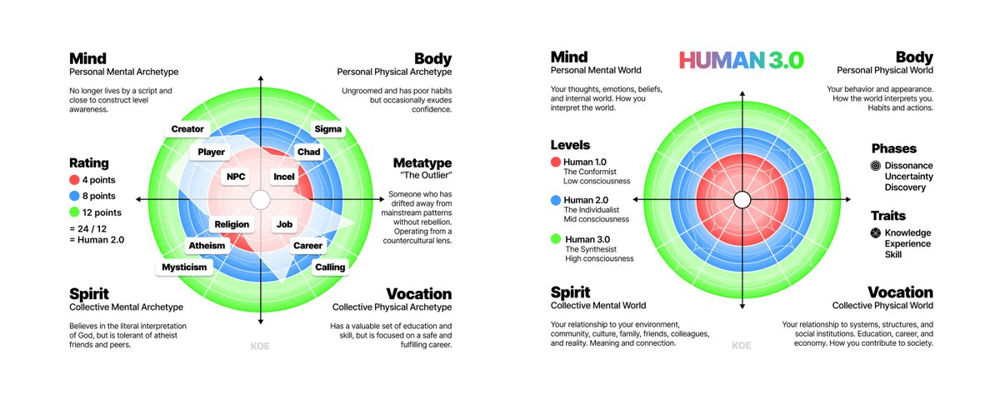
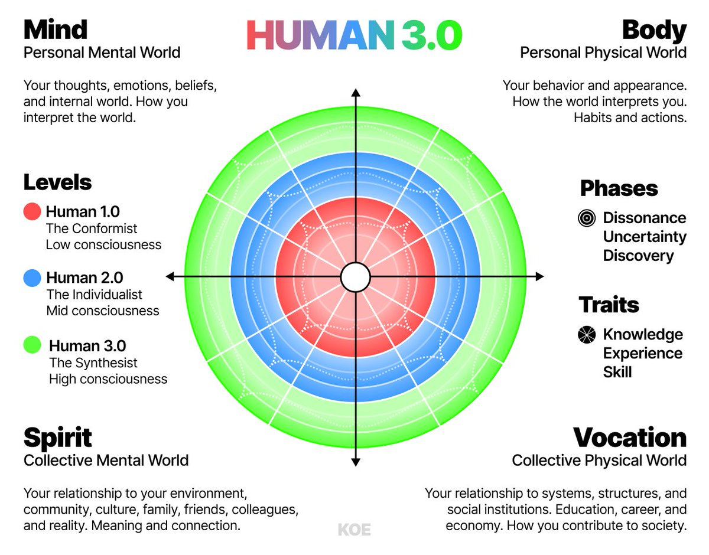
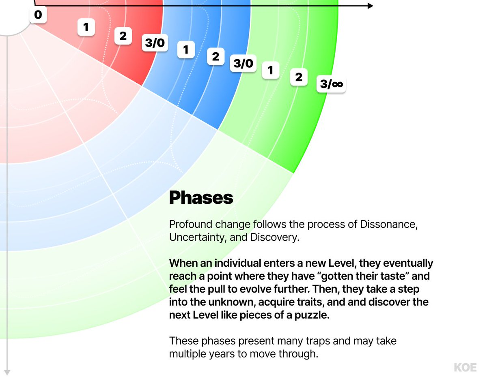
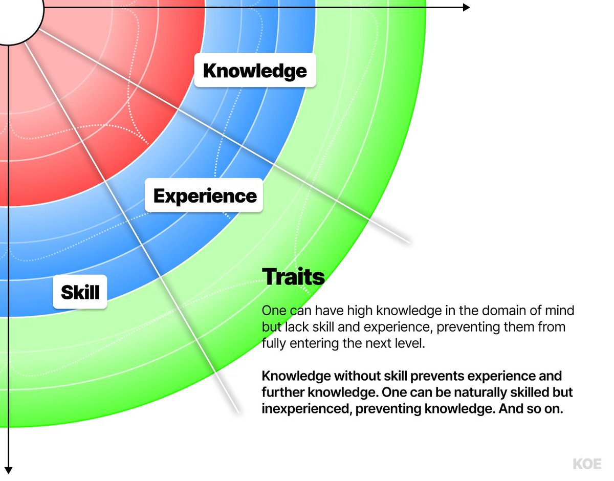
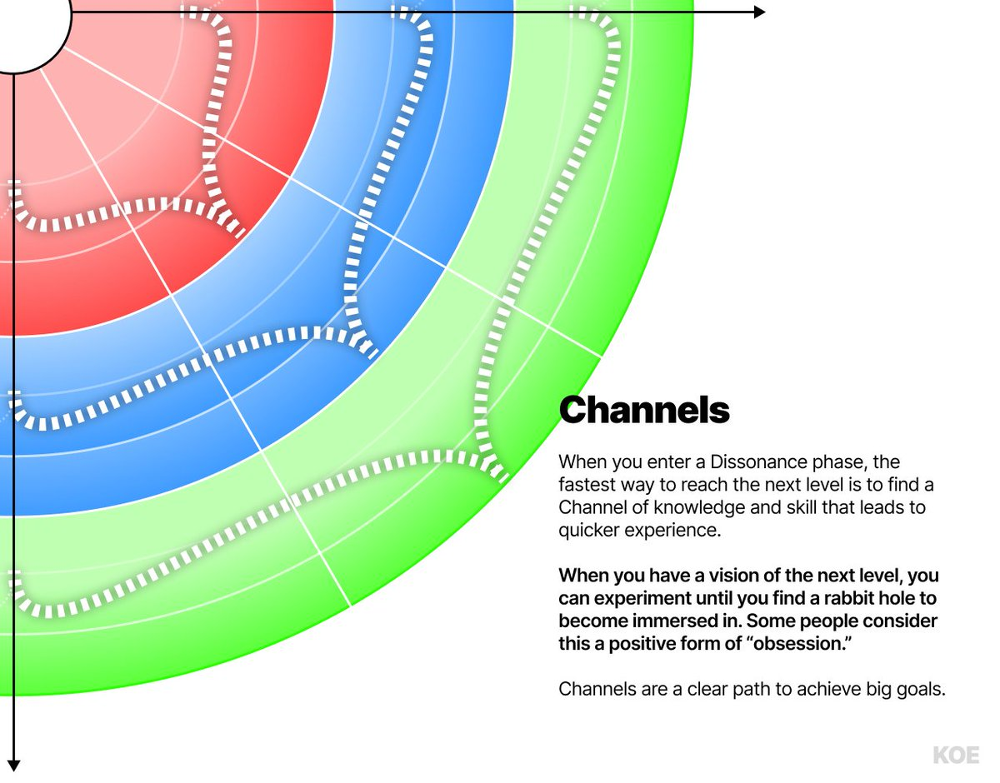
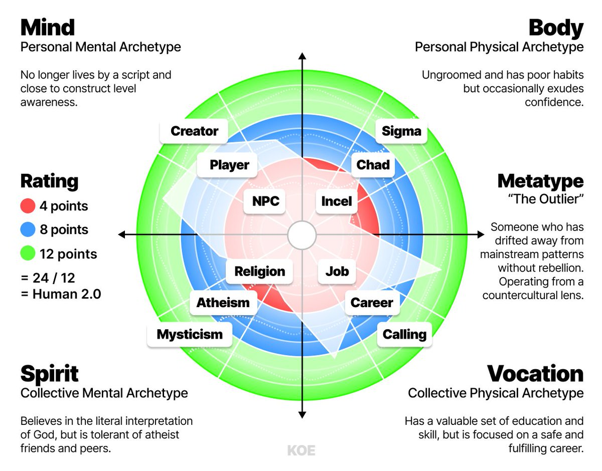

# Human 3.0 —— 通往前 1% 的地图

> 来源：[https://x.com/thedankoe/status/2023779299367809063](https://x.com/thedankoe/status/2023779299367809063)

## Human 3.0 —— 通往前 1% 的地图

这话听起来可能有点中二，但我一直都想把自己打造成一个“六边形战士”。

不只是练出一副好看、强壮的身材，而是在人生的每个维度都完成升级。

我想成为一个多维度拉满的人。我想把自己的所有属性点都点满。我不想当 NPC。我想当 100 级玩家。整张地图全解锁。体能、智力、职业能力全满级。金币爆仓。我想全部拿下：心智、身体、精神、关系、金钱。

这个渴望，深刻影响了我的人生。

青春期时，我对健身上头；然后我开始疯狂吸收知识；再后来我想获得自由，于是不断试错各种商业模式，直到终于跑通一个。期间我也经历了许多灵性和哲学阶段，这些经历让我看待“钱和健身”这类看似表层的追求时，和大多数人的视角完全不同。

过去 15 年里，我钻研了心理学、个人成长、哲学、社会互动、技术、互联网、创业、金钱、宗教和意义等领域。

过去 6 年，我持续在网上写这些研究心得，也逐渐看到了很多关键的“重叠模式”，它们正在形成一种面向当代世界的新哲学。是我的个人哲学，但也许会和你产生共鸣。

这就是 HUMAN 3.0 的由来。

我想把这些年学到的一切，整合成一张能在现代世界中导航的总地图。我想给你一套知识、技能与原则，帮助你摆脱平庸，兑现你最高的潜能。我会尽可能让它非教条、且有科学依据；但我也会用足够清晰、坚定的表达，把核心意思讲透。我会用当代语境下自然、直白的语言来写，并尽量把概念讲简单，避免它变成一本“看完就忘”的教科书。所以我会按我平常说话的方式来写，细节层面的微妙之处交给你自己消化。真正的 nuance 和批判性思考，永远在读者手里。

这里面很多内容可能是错的，我也鼓励你质疑我说的一切。更重要的是，我希望你能和我一起把这套模型迭代出来。如果你在自己的文章或内容里谈 HUMAN 3.0，我很想看到。把这些想法拿去扩展、升级。如果你喜欢 H3.0 模型，就直接用。

当然，市面上已经有很多很棒的模型。

比如 Spiral Dynamics（心理学）、佛教与基督教（意义）、唯物主义与唯心主义（现实本质）、电商与咨询（商业）、红丸与女权（社会互动）等等。你随便看一个方向，都能找到几十上百个“承诺解决你全部问题”的模型。

它们都有其真理性，但关键缺陷在于：它们常常只覆盖人生中的一个维度或一个视角。我们在学校里把数学、语文、科学拆成彼此隔离的学科去学，可真实知识其实是一张无限嵌套的网。我们在实验室里解剖青蛙并下结论，却不去看它背后的整套生态系统和相互关系。再往深一点说（对有些人可能不太好接受）：很多灵性导师身体很脆弱；很多商人维系不好关系；很多“alpha 男”情绪并不对齐。它们各自都算是很厉害的成就，但一个人若能在多维度上真正完成自我发展，依然罕见。

即便有些模型或大师确实连接了多个维度（比如古希腊哲学），它们大多流行于互联网、科技和 AI 彻底改写世界之前。更重要的是，很少有模型认真触及“工作与金钱”这类主题，而这恰恰是大多数人最耗心力的部分。

今天，我们先把 HUMAN 3.0 的地基打好。

在接下来的几个月（也可能几年）里，我们会一起拆解“到底什么才叫把人生活到极致”。这篇导论没法覆盖模型里的所有细节。

> 注：我已经整理了一份 HUMAN 3.0 知识库，里面包含模型的细节、文明层面的影响、历史语境、科学基础，以及我个人的原则。想看完整且便于速读的全貌：
>
> [点这里阅读](https://letters.thedankoe.com/p/a-complete-knowledge-base-of-human)
>
> 也可以直接丢给 AI 去探索。我会在文末再放一次链接（建议先读这篇）。

## HUMAN 3.0 —— 最大化你潜能的模型

我做了一个

[AI Prompt](https://letters.thedankoe.com/p/prompt-human-30-self-discovery-and)

来帮助你绘制自己的成长地图、找到你的 Metatype，并定位你人生下一步要解决的核心问题。下面我也会放链接。我建议先读完这篇文章，先把整体框架弄清楚。

这个模型提供的是“全景视角”。它不是一套教条化的步骤清单，而是一组指导原则，帮助你更快突破心智、身体、精神和职业上的平台期，逼近你的最大潜能。它把人类发展中的共性模式做了定向整合，并叠加了大量已经被验证过的科学、心理学、灵性与职业模型成果。

我的目标是：把世界上最好的理论精华，真正应用到“个体的人生”里。

> 当你理解了这个模型，就可以开始标注自己在每个象限中的发展层级（你的 Archetype），以及你整体的发展形态（你的 Metatype）。然后，你就能有意识地向 3.0+ 级 Metatype 移动，也就是把人生各维度都尽可能拉满的人。

这些内容我们会在后文继续展开。现在先打基础。

1) 象限（Quadrants）

Human 3.0 的基础，是代表人生四大维度的四个象限。

-   Mind（个人内在心智世界）—— 你的思想、情绪、信念与内在世界。你如何解释这个世界。

-   Body（个人外在身体世界）—— 你的行为与外在呈现。世界如何解读你。包括饮食、训练、兴趣、习惯、仪容、沟通、穿着等。

-   Spirit（集体内在精神世界）—— 你与环境、社群、文化、家庭、朋友、同事以及“现实本身”的关系。你如何获得意义与连接。

-   Vocation（集体外在职业世界）—— 你与系统、结构和社会机构（如教育、职业、经济）的关系。你如何融入并贡献社会。

该框架改编自 Ken Wilber 的 AQAL 模型。四个象限代表四种基础视角，构成一张相对通用的“知识与经验地图”。

> 这张现实地图能避免“片面思考”，也不会把问题压缩成单一视角。一个内在心智问题，未必该靠换工作这类职业手段解决；一个精神问题，也未必该靠营养干预来解决。资本主义者和基督徒都可能在自己的领域里发展得很好，但一旦把自己的模型强行套到其他领域，就会遭遇本可避免的痛苦。金钱常常解决不了意义，反之亦然，但这不代表它们彼此无关。所有维度都在重叠。你在这些维度里同步成长，才会逐渐获得对未来的掌控力。由于人生、成长和进化都在朝“更高的混沌或复杂度”展开，而有序结构会被创造出来以约束混沌，所以我们可以把人生（尤其是个人成长）理解为“持续解题”。

一颗种子会展开，最终长成花朵。花比种子复杂得多，而它要达到这个状态，必须从环境中获取资源来自我发展。种子本能地想生长；通过漫长进化，它“解决”了那些让许多植物物种灭绝的问题。

你也许会说，种子并没有“有意识地”在成长或解题。但通过观察，并把模式映射回我们的人生，我们会这样描述它，因为我们创造了语言。于是我们能看见：生命天然会流向更高复杂度。复杂度带来问题，而为了约束由复杂度引发的熵，必须通过创造生成新的有序结构。

在你的个人进化里，过程通常是：你想兑现潜能 → 你向未知迈一步并进入复杂系统 → 你获取知识与技能，解决阻碍前进的问题（或者停滞，让混沌吞噬你）→ 你的身份扩展并跃迁到新层级 → 重复，直到你卡住为止。

这个模式在现实的许多层面和领域都能观察到。你可以自己再想几个例子。为了简洁，我们继续。

2) 层级（Levels）

每个象限里都有 3 个宏观发展层级，分别代表低意识（1.0）、中意识（2.0）和高意识（3.0）。

这些层级参考了发展心理学中的多种模型，比如 Spiral Dynamics 和自我发展九阶段（9 Stages of Ego Development）。它们本身已经是很多心理学理论的研究整合。简言之：它们显示出，我们的心智（价值观、信念、世界观，进而影响思考与决策）会随着时间沿着可预测的阶段演化。

-   Human 1.0（Conformist，遵从者）—— 重视既有权威与传统。典型特征是思维狭窄、非黑即白，认为只有“唯一正确路径”，通常来自童年条件化。

-   Human 2.0（Individualist，个体主义者）—— 拒绝常规，追求自己的目标。渴望获得地位、被视为有价值。相比 1.0 更少狭隘，但常会变成“我的路才是对的”。

-   Human 3.0（Synthesist，综合者）—— 能容纳多重视角，连接现实中的多种模式，并策略性地开辟新路径。TA 明白每个视角都包含部分真理，可被综合成更整体、更双赢的结果。TA 也可能表现出某些看似 1.0 的特征（如屏蔽噪音带来的“窄焦点”），但那是有意识的策略选择。

在 Spiral Dynamics 这类模型里，“螺旋”描述的是：个体在成长中会在“自我”和“他者”之间反复切换关注点（例如从宗教共同体中抽离，转向个体无神论）。在 Human 3.0 里，这常发生在某个象限完成跃迁时。比如一个人在 Mind 象限已经成为 Individualist，关注点就可能转向 Spirit；而在 Spirit 里，TA 仍停留在 Conformist 阶段，倾向服从权威。

每个层级在不同象限会有不同表现。比如在 Vocation（右下）里，一个 3.0 Synthesist 能有效利用 AI 推进终身事业；而一个 1.0 Conformist 可能因缺乏知识、技能与经验，把 AI 简化为“纯粹邪恶”。

在 Body（右上）里，低意识个体不理解自己摄入的营养如何作用于身体，容易走向肥胖与懒散，因为 TA 还没建立出支持更优决策的 Traits（能力特质）；而高意识个体理解不同营养与身体的交互机制，并能基于目标动态优化饮食。

> 这些层级反映的是：你在某一领域的“自我复杂度”。整张 Human 3.0 图其实就是“你”本身。你的复杂度越高（通过拓展视角、扩展意识），人生就越有趣，因为你可以主动选择自己要挑战什么。像打游戏：Level 1 更像按脚本运行的 NPC，Level 2 是开始自己选主线的主角，Level 3 是能设计新游戏、让别人也愿意玩的程序员。
>
> 注：低层级或高层级不代表“坏”或“好”，只是个人旅程上的阶段点。所谓“高意识”不是更高贵，而是更成熟；成熟自然会带来明显的
>
> [收益。你](https://perks.you/)
>
> 并不会“离开”旧层级，而是“超越并整合”它。你会获得更大的视角，进而调用你在低阶段积累的知识、技能和工具。

我们后面会讲更多具体例子。

如果你喜欢这类内容，

[可以在这里订阅](https://letters.thedankoe.com/)，

这样就算算法没推到，你也能直接收到我的文章。

3) 阶段（Phases）

每个层级里都有 3 个发展阶段，必须经历完，才有机会进入下一层。Phases 对应“纵向发展”：要么向上跃迁，要么向下回落。

当一个人经历深层变化时，通常会出现 3 种共性模式：

-   Dissonance（阶段 1：失调）—— 当一个人已经“吃透”当下阶段的人生后，如果没有被狭隘与舒适麻痹，就会对现状感到厌倦，但还不知道下一种人生长什么样。

-   Uncertainty（阶段 2：不确定）—— 若这个人足够觉察到这种厌倦，就会带着不确定迈向未知，并向新的知识与技能开放。

-   Discovery（阶段 3：发现）—— 像在地图上探索一样，TA 会找到教育、工具、资源与洞见，从而升到下一个发展层级。

为了表达方便，我们可以把“某领域中的层级 + 阶段”拼在一起描述一个人的状态。

例如，“Vocation 2.1”（层级 2、阶段 1）表示其“集体外在意识”（与系统、结构、社会机构的关系）处在 Individualist 层级，且已经快耗尽这一阶段，必须向 3 级迈出不确定的一步，去发现下一章。放在职业象限里，这可能意味着：TA 换了职业，但发现自己其实在爬错梯子，需要转向探索真正使命。

> 这个过程中，人很容易进入“伪转化（False Transformation）”。TA 感觉自己好像完成了阶段跃迁、升到了新层级，但其实只是模仿了该层级的外在样子，并未完成必要的 trait（能力特质）发展。这是一种自我欺骗，会把人困在当前层级，直到 TA 把当前层级尚未解决的问题处理完。
>
> 这种伪转化也会发生在：你在某一领域确实升级了（比如 Mind），就误以为自己在另一个领域（比如 Spirit 或 Vocation）也升级了。
>
> 人也会在短期高压期，或当超出当前层级的问题突然闯入时，临时回落到更低层级。这也解释了为什么你会怀念某个“以前感觉更好”的阶段，并想把那种状态找回来。

按照心流心理学和包括尼采在内许多哲学家的观点，真正有生命力的人生来自于：在这些阶段中不断克服阻力并前进。深层改变很少偶然发生。当你对愿景、目标、优先级保持刻意性，不因分心和舒适而回落时，那些本可吞噬大多数人的混沌，反而会变得可承受，甚至成为你最珍贵、最有成就感的人生片段。

到 3 级及以上后，你可以主动追求更复杂挑战，甚至为了“热爱游戏本身”而模拟这些阶段（比如某 CEO 卖掉公司后陷入低谷，又从更开阔的视角再创业）。当你开始定义游戏规则，游戏就变成了无限游戏。

4) 特质（Traits）

在每个阶段里，都有一条由知识、经验和技能组成的“门槛线”。跨过它，下一阶段才会向你显现。Phases 代表纵向发展；Traits 代表横向发展，也就是你在未知地形里不断摸索，直到积累足够，进入下一阶段。

每个象限、层级和阶段都会抛出不同挑战，它们都要求相应水平的技能；而技能必须通过实验和学习获得。

> 你可以很懂健身理论，但没有实践和经验，就会变成“胖私教”原型。知识值得尊重，但别人未必会买账，这本身有利有弊。

无论纵向（phases）还是横向（traits）发展，最大的陷阱都是“无聊”和“焦虑”。

你如果没技能和经验就硬跳层，结果往往是焦虑和失败；你如果完全不尝试上层，只待在原地，就会无聊，最后回到舒适和分心。

无聊与焦虑都会把你的心智拉入失序状态，让你脱离进化展开的“流”。你的人生看上去可能没问题，但内里会越来越钝、越来越空。

这就引出 Channels：一种对抗失序、实现实质进展的方法。

5) 通道（Channels）

当你到达任一层级的 Dissonance 阶段时，你就获得了调动“Channel（通道）”的能力。

你可以把 Channel 理解成游戏里一条让人兴奋的任务线：一个知识或技能的“兔子洞”。你会对一个主题停不下来地研究，或对一个项目停不下来地推进，不知不觉时间就过去了。

在 Human 3.0 图上，一条 Channel 的一端连接知识 trait，另一端连接技能 trait。通常一个人会对“学习”或“创造”产生近乎上瘾的专注，这会带来经验值的快速增长，把 TA 在某个象限里迅速推向下一层。

举几个例子：

-   Mind —— 进入很深的冥想状态（技能）；或沿着一个思路越想越兴奋，半夜都停不下来，最后冒出一连串点子（知识）。

-   Body —— 你发现了一种新饮食/补剂/训练法，然后把相关内容一次性刷爆（知识）；你会连续 3 个月痴迷跑步或力量训练，进步速度超过以往（技能）。

-   Spirit —— 神秘体验、热恋期、深度亲密时刻，或在当下人生阶段突然遇到“很对味”的哲学框架，等等。

-   Vocation —— 到达极高清晰度后迅速推动职业转向、产品发布或创作爆发（技能）；你遇到一个完美机会，于是疯狂补齐创业所需技能（知识）。

进入 Channel 的过程通常是这样的：

首先，你要在当前层级充分适应后进入 Dissonance。你开始厌倦现状；只要你没有对问题麻木，就可以把这种“不满意”当燃料，推着自己进入未知。你在某个象限（例如 Body）里设定目标、愿景或方向；然后一边学一边做；犯错、修正；持续实验，直到撞上那个把你“吸进去”的 Channel。

判断一个人是否进入了 Channel，很简单：看 TA 谈这件事时有多兴奋。比如一个人写书写到“文如泉涌”，根本停不下来。TA 有愿景，技能和知识带来的清晰感，会让进展呈现喷发式前冲。

当你处于 Dissonance 阶段时，我能给的最好建议是：去追你真正兴奋、真正有热情的方向，不要羞耻。因为这种羞耻往往来自更低层级的 Mind；而你恰好可以在这个过程中，练出“自信”这项技能。

> 关于“Glitches（漏洞加速）”：有些手段可以强行把你推入 Channel，或让你快速突破发展平台期，我们称之为 “Glitches”。就像矩阵里的漏洞；如果把矩阵理解为你在 1 级和 2 级的边界，那么到 3 级你会开始建立自己的矩阵。
>
> 迷幻剂可能强行触发神秘体验；PED（提升表现药物）可能加速体能进步；租下自己暂时负担不起的房子，可能会制造真实死线，逼你边学边做，把副业做起来。
>
> [AI](https://work.ai/)
>
> 是最新、最普及、且跨越所有领域的 Glitch。它可以让你快速自我发展，也能让你快速自我毁灭。你必须有品味和辨识力。把 AI 看成“纯善”或“纯恶”，都只是有限视角。
>
> [请保持警惕](https://perspective.be/)。
>
> 这些手段确实能加速进展，但意识层级越低，风险越高。你若在没有经验解释 altered state（意识改变状态）的前提下使用迷幻剂，可能直接精神崩溃。如今“AI 精神病式沉迷”以及把思考外包给 AI 的情况正在增加，不是因为 AI 坏，而是它很像类固醇。你若没打好基础、没系统研究“营养全域”、没理解潜在交互、也没长期训练（打个比方），AI 的副作用会很重。即便如此，现实里很多高收益机制天然就带代价，再谨慎也无法归零。对某些目标明确的人来说，TA 可以在明知后果下主动承担风险。对大多数人，尤其 1 级人群，这常常是“致命级”的。
>
> 先把你的“自然潜力”练满，这样经验更足，不会被一击带走。知识和技能会显著降低风险。

如果你现在很迷茫，你大概率正处在 Dissonance 阶段。熬过去，你就能找到下一个 Channel，再次爱上生活。

## 原型（Archetypes）与元型（Metatypes）

在之后的文章和视频里，我们可以用 Human 3.0 图来理解具体的人（比如 Jordan Peterson、Andrew Tate、Alan Watts），也可以拿它来拆你的人生问题，比如“为什么赚不到钱”或“为什么找不到伴侣”。

如果你有具体想解决的问题，或有想分析的人，欢迎回复这篇。

在这套模型里，我加入了 Archetypes 和 Metatypes：

-   Archetypes（原型）—— 某些“人类模式”，会在特定象限及其层级中反复出现。

-   Metatypes（元型）—— 同一个人四个象限原型的综合结果。

你可以把 Metatype 理解为一种“用于自我发展的性格测试”。

我做了一个提示词，帮助你识别自己的 Metatype，映射你在所有象限里的发展状态，并

[在这里找到你人生的核心问题。](https://letters.thedankoe.com/p/prompt-human-30-self-discovery-and)

上图中我每个象限只展示了 3 个 Archetype。实际远不止这些，所以别把它们看成定死的分类。我这里只是先用它来演示。

你会发现：当一个人在某个象限持续发展时，往往会从低意识向高意识呈现出总体进程：

Mind 象限中的 NPC → Player → Creator，描述的是：一个人先停止按“出生时分配给你的剧本”活着，然后开始玩自己的游戏，最后能创造新的游戏给自己和他人（类似“建构层意识”）。

Body 象限中的 Incel → Chad → Sigma，或 Beta Male → Alpha Male → Sigma Male，是当下常见的社会原型，能从行为和外形上观察到。它既可能对应图中其他区域，也可能由同一象限内部机制继续推动。比如 Incel 往往伴随饮食和环境导致的雌激素偏高；而 Vocation 象限中的社会结构（加工食品、微塑料等）又会在群体层面进一步加剧这一问题。

Vocation 象限中，Job → Career → Calling 是多种进程之一。在工作议题上，起点可以非常多样：有人甚至没“正式工作”，也有人很早就走向使命。关键洞见是：每个层级都从低意识（Conformist）起步，并都具备走向高意识（Synthesist）的可能。

Spirit 象限里，Religion → Atheism → Mysticism 是一种常见路径（但不是唯一）。它常见于在严格宗教家庭长大的人：先反叛，再在更高层次上重建对“神”的理解，并回到 1 级里原本就包含的某些真理。

> Ken Wilber 的“前/超谬误（pre-trans fallacy）”指的是：人们会把“前理性（Conformist）”和“超理性（Synthesist）”混淆，因为从传统理性（Individualist）的视角看，它们都像“非理性”。这种混淆可以双向发生。
>
> [一方面](https://ways.one/)，人们可能把 1 级的原始状态拔高成 3 级；
>
> [另一方面](https://thinking.in/)，也常有人把真正的 3 级发展误判成“原始思维”。
>
> 换句话说，一个只停留在童年条件化、缺乏更广知识与经验的“圣经原教旨者”，很难认真看待一个神秘主义者；而后者往往只是站在更完整的视角上，触达了相似的真理。
>
> 如果还不直观，可以想想那个
>
> [IQ 钟形曲线梗图](https://knowyourmeme.com/memes/iq-bell-curve-midwit)。

当然，这只是 Spirit 象限里发展进程的一个小例子。个人关系、运动、家庭、科学或形而上信念等方面，还会出现很多其他模式。

每个象限里可能有几十到几百种 archetype，不止我图里展示的三个。

回到上面的示例：当我们把一个人在各象限、层级、阶段和 traits 上的点位标出来，就能较完整地理解 TA 所处的位置（图里白色半透明区域就是示意）。

这个示例人物会落在 Human 2.0。

怎么算出来的？

每个 Level 1 记 1 分。

每个 Level 2 记 2 分。

每个 Level 3 记 3 分。

然后总分除以 12（图上总共 12 个发展切片），得到 2.0。

在这个例子里，我们可以这样描述 TA 在各象限的发展：

-   Mind —— 已不再按剧本生活，接近建构层意识。

-   Body —— 仪表欠佳、习惯较差，但偶尔会散发出自信。

-   Spirit —— 相信“字面意义上的神”，但对无神论朋友和同侪保持包容。

-   Vocation —— 拥有有价值的教育与技能组合，但目标仍偏向“安全且有满足感”的职业路径。

如果我们每个象限不只映射 3 个 archetype，而是映射更多维度，模型会复杂得多、也完整得多。这部分留到后续文章。

接下来，把以上四象限描述合并，就得到这个人的 Metatype。我打算借助 AI 来做这件事，因为我不想把它做成那种“静态人格测试”，把人硬塞进 16 个通用盒子。

在这个例子里，我们可以把此人的 Metatype 称为“Outlier（异轨者）”。简而言之：这是一个没有通过反叛、却逐步偏离主流模式的人，常从逆主流视角行动。TA 不太在意外表，但这也可能是伪转化，因为 TA 在 Body 象限里仍缺经验。

## 3.0 生活方式

“要怎么在四个象限里保持平衡发展？尤其当某一个象限已经吃掉大量时间、专注和精力时？”

终极目标，是打造一种“通过持续解题来覆盖四象限”的生活方式。

如果你的 Vocation 占用了太多时间，导致 Mind 崩溃、Body 被透支、Spirit 无暇顾及，这就是一个你必须解决的明确问题。解决路径依然是：补知识、练技能，并争取形成一个 Channel。比如你可以每天抽一小时研究商业机会，再留一点时间做实践。也许你比别人慢，但只要开始推进 phases，你就会更有信心逐步降低，甚至彻底摆脱那个吞噬你时间的工作。

这个转变又可能暴露新问题：比如精力低、或在潜在客户眼中缺乏可信度。你要把事业推到下一层，未必需要“更多商业知识”，反而可能要先解决身体、心智或精神层面的问题。即便你做出一个很成功的生意、赚到很多钱，也仍可能因为职业追求里缺乏意义，而感觉胸口中间空了一块。

当你用“持续解题”的方式生活（并警惕那些让你看不到问题的分心），你就会慢慢进入这样的状态：工作像游戏，健康成为默认值，意义感充沛，而你的大脑终于站在你这一边。

如果你真的一路读到了最底部，respect。

[https://x.com/thedankoe/status/2023779299367809063](https://x.com/thedankoe/status/2023779299367809063)
